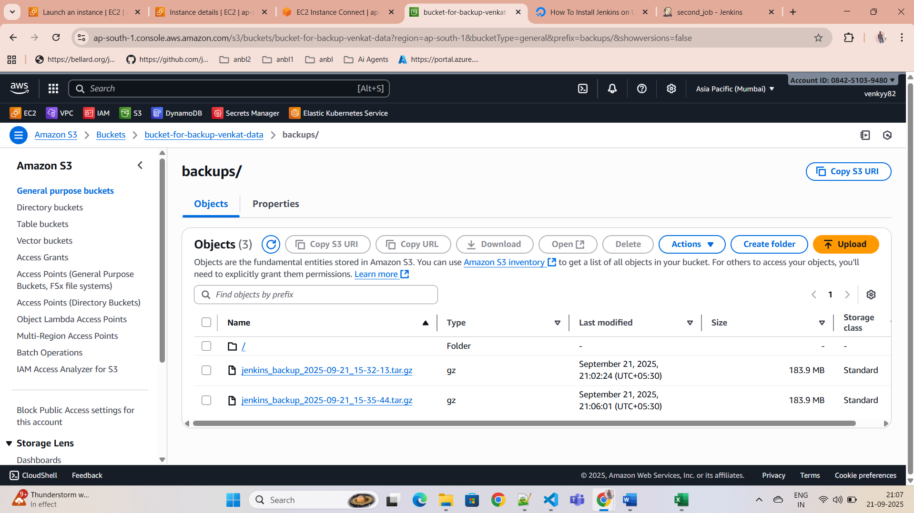

# Jenkins Backup and Restore Script

It contains scripts and instructions for backing up and restoring your Jenkins data, including jobs, configuration, and other important files. It allows you to efficiently restore a Jenkins instance from a backup in case of failure or migration.

---

## Table of Contents

1. [Backup and Restore Overview](#backup-and-restore-overview)
2. [Prerequisites](#prerequisites)
3. [Restore Instructions](#restore-instructions)
4. [Selective Restore (Jobs Only)](#selective-restore-jobs-only)
5. [Troubleshooting](#troubleshooting)

---

## Backup and Restore Overview

This guide demonstrates how to restore Jenkins from a backup stored on **Amazon S3**. The restore process involves extracting the backup archive and ensuring proper permissions are applied for the Jenkins service to access the restored data.

You can restore **all Jenkins configurations** or **only the Jenkins jobs** if you prefer not to overwrite the entire Jenkins setup.


---

## Prerequisites

Before you begin the restore process, ensure that you have the following:

1. **AWS CLI installed** and configured to access the S3 bucket.
2. **Jenkins** installed and running on your system.
3. **Backup Archive**: A `.tar.gz` archive of your Jenkins backup stored in an S3 bucket. The archive should contain all or specific parts of your Jenkins data.
4. **Sufficient Permissions**: Ensure you have root privileges to access Jenkins configuration files and directories.

---

## Restore Instructions

### 1. Download the Backup Archive from S3

First, download the backup archive from your S3 bucket to a temporary location on your Jenkins server:

```bash
aws s3 cp s3://bucket-for-backup-venkat-data/backups/jenkins_backup_2025-09-21_15-35-44.tar.gz /tmp/jenkins_backup.tar.gz
```

This command downloads the backup file `jenkins_backup_2025-09-21_15-35-44.tar.gz` from the S3 bucket to the `/tmp` directory.

### 2. Extract the Backup Archive to Jenkins Home Directory

Once the backup file is downloaded, extract its contents into the Jenkins home directory (`/var/lib/jenkins`). This will restore your Jenkins configuration, plugins, jobs, and other data.

```bash
sudo tar -xzvf /tmp/jenkins_backup.tar.gz -C /var/lib/jenkins --strip-components=1
```

* The `--strip-components=1` flag ensures that the extracted files are placed directly in `/var/lib/jenkins` without an extra directory layer.

### 3. Fix Permissions

After extracting the files, the ownership and permissions must be corrected to ensure Jenkins can access them:

```bash
sudo chown -R jenkins:jenkins /var/lib/jenkins
```

This command changes the ownership of the Jenkins directory to the `jenkins` user and group.

### 4. Restart Jenkins

Finally, restart the Jenkins service to apply the restored data:

```bash
sudo systemctl restart jenkins
```

Jenkins should now be restored to the state it was in at the time of the backup.

---

## Selective Restore (Jobs Only)

If you only need to restore the Jenkins **jobs** directory and not the entire Jenkins configuration, you can selectively restore just the `jobs/` directory from the backup.

### Steps to Restore Only Jobs:

1. Download the backup archive (if not already done):

   ```bash
   aws s3 cp s3://bucket-for-backup-venkat-data/backups/jenkins_backup_2025-09-21_15-35-44.tar.gz /tmp/jenkins_backup.tar.gz
   ```

2. Extract **only the jobs directory** from the backup:

   ```bash
   sudo tar -xzvf /tmp/jenkins_backup.tar.gz -C /var/lib/jenkins jobs
   ```

   This will restore only the Jenkins jobs, keeping your current Jenkins configuration intact.

3. Fix Permissions:

   ```bash
   sudo chown -R jenkins:jenkins /var/lib/jenkins
   ```

4. Restart Jenkins:

   ```bash
   sudo systemctl restart jenkins
   ```

After these steps, your Jenkins jobs should be restored, and Jenkins will continue running with the same configuration as before.

---

## Troubleshooting

If you encounter any issues during the restore process, consider the following:

### 1. **Permissions Issues**

* If Jenkins fails to start or certain jobs don't appear after restoration, check the ownership of the Jenkins home directory and its subdirectories. Ensure that all files are owned by the `jenkins` user and group:

  ```bash
  sudo chown -R jenkins:jenkins /var/lib/jenkins
  ```

### 2. **Missing or Corrupted Data**

* If the restore does not work as expected (e.g., jobs are missing or Jenkins is not starting properly), verify that the backup archive is complete and correctly downloaded. You can recheck the S3 backup or attempt another download.

### 3. **Jenkins Configuration**

* If you are restoring from an older backup or migrating Jenkins to a different version, you might need to adjust the configuration for plugins or job definitions that depend on specific Jenkins versions.

---

