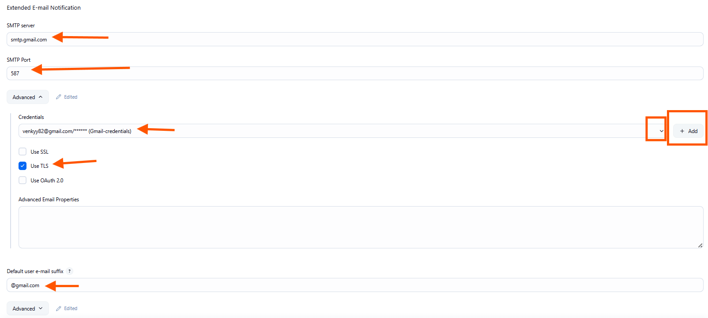
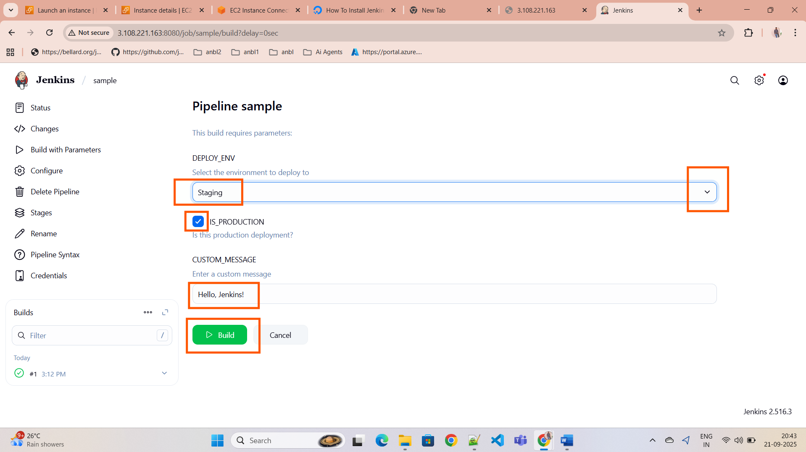
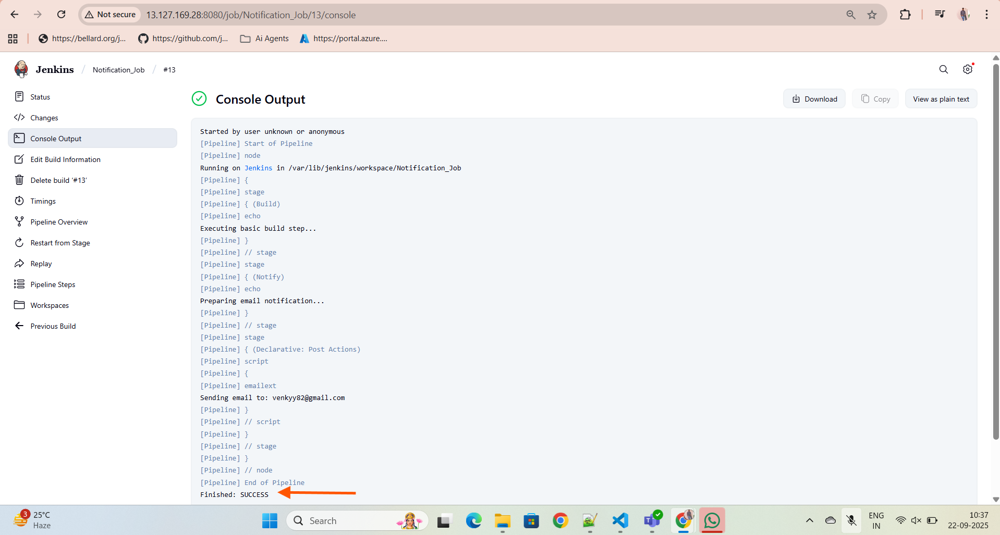
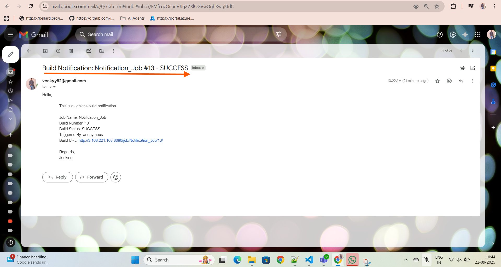

# Sending Email Notifications in Pipeline

*  Enable Security Group inbound&outboud required ports

we have to install the Required plugins For sending an Email to our mail.

then we have to configure them by using our Gmail app Password not with email password.

and also one more plugin

create a new Jenkins Job and trigger Jenkins Job and see the output

we can cross check our email for confirmation.

