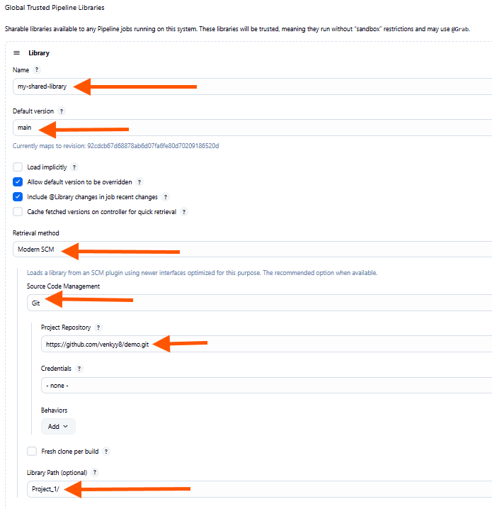
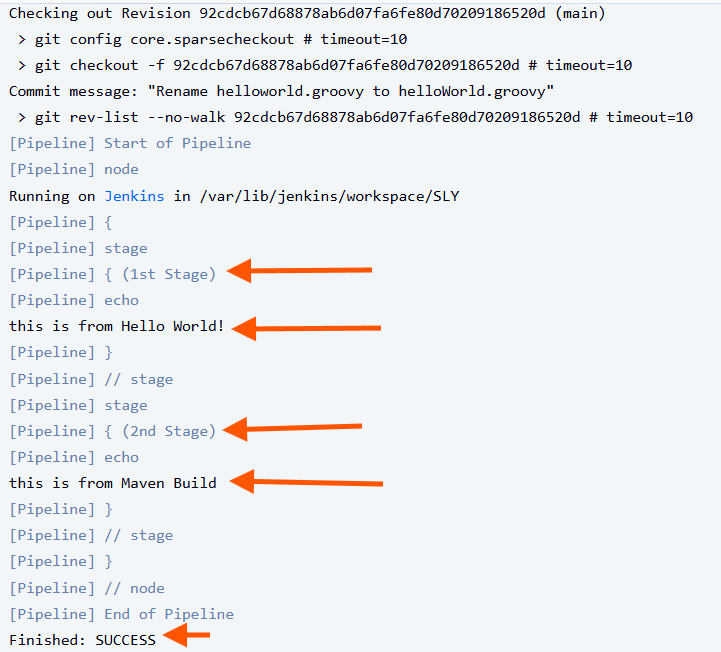

# Jenkins Shared Library

it contains reusable Jenkins pipeline shared libraries to help standardize and simplify your Jenkins pipelines.

---

## Overview

A Jenkins Shared Library allows you to create reusable pipeline code that can be shared across multiple Jenkinsfiles and projects. This helps reduce duplication and centralizes pipeline logic.

In this repo:

- `vars/` — contains global variables or pipeline steps callable from Jenkinsfiles


---

## How to Use This Shared Library in Jenkins

### 1. Add Shared Library to Jenkins Configuration

1. Go to **Manage Jenkins** > **Configure System**.
2. Scroll to **Global Pipeline Libraries** section.
3. Add a new library:
   - **Name:** `my-shared-library` (or your preferred library name)
   - **Default version:** `main` (branch name)
   - **Retrieval method:** Modern SCM
   - **Source Code Management:** Git
   - **Project Repository:** `https://github.com/venkyy8/demo.git` (replace with your repo URL)
   - **Credentials:** Add if your repo is private
   - **Library Path:** `Project_1` (if your library is inside a subfolder)

Save your configuration.




---

### 2. Use the Library in Your Jenkinsfile

```
create Jenkinsfile File by referring the Shared Libraries
````

---

## Adding New Shared Steps

To add a new shared pipeline step:

1. Create a new Groovy file inside `vars/` directory. For example: `myStep.groovy`
2. Define a `call` method inside it, for example:

```groovy
def call(String name) {
    echo "Hello from myStep, ${name}!"
}
```

3. Commit and push changes to your shared library repo.
4. In Jenkins, your pipelines can call `myStep()`.

we can see the jenkins console output:


---

## Troubleshooting

* Ensure the library name in `@Library('name')` matches the one configured in Jenkins.
* Check that your method names and file names match exactly (case sensitive).
* Use `Wipe Workspace` on Jenkins jobs if you encounter weird caching issues.
* Make sure your library is on the correct branch (`main` or other).
* Ensure proper permissions for Jenkins to access the repo (add credentials if private).

---
